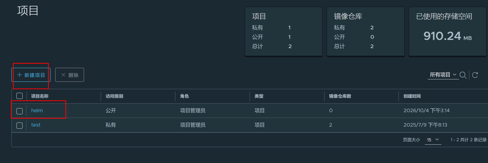
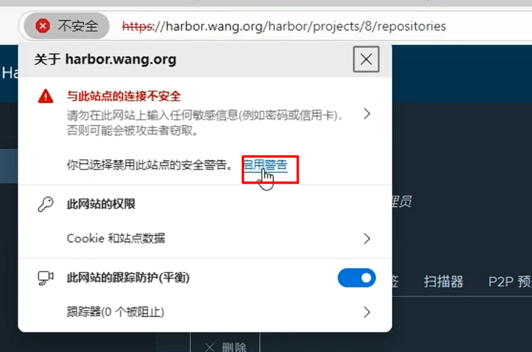
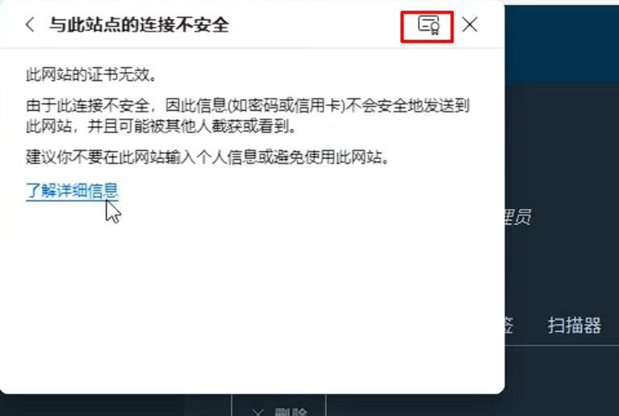
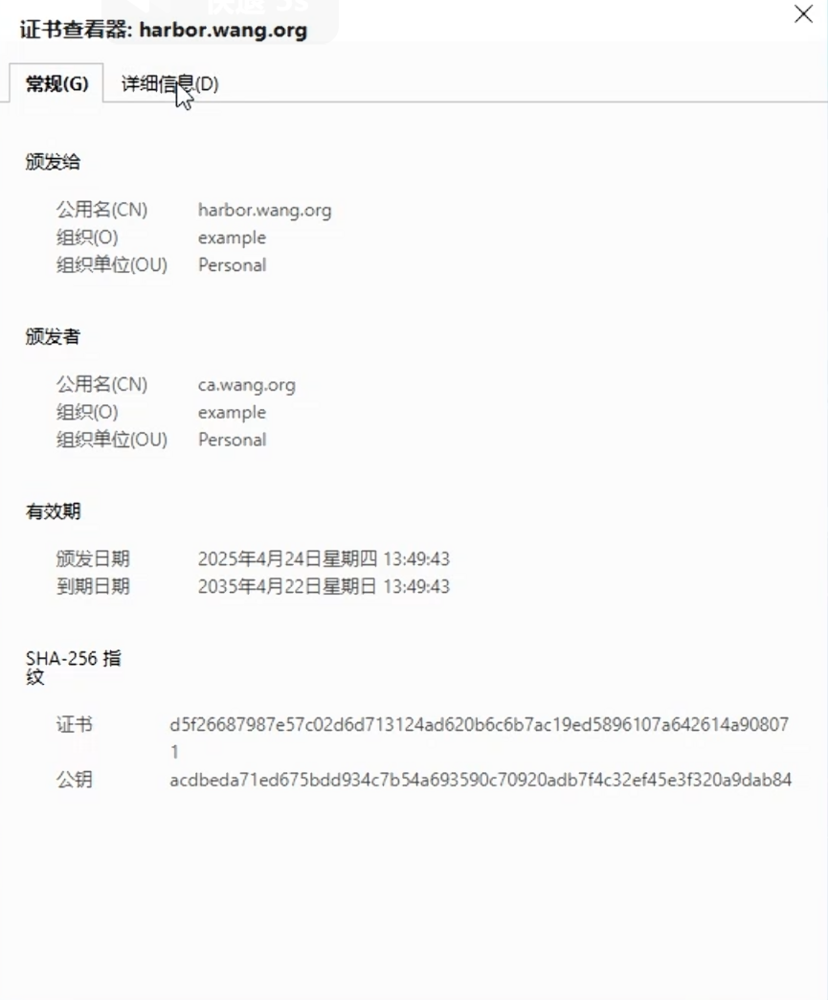

# Chart 目录结构

[Getting Started | Helm](https://docs.helm.sh/docs/chart_template_guide/getting_started/)

**使用 Golang 模板语法**

[https://pkg.go.dev/text/template](https://pkg.go.dev/text/template )

[https://helm.sh/zh/docs/chart\_template\_guide/data\_types/](https://helm.sh/zh/docs/chart_template_guide/data_types/)

​  

附录：Go 数据类型和模板

Helm 模板语言是用**强类型Go编程**语言实现的。 因此，模板中的变量是有类型的。大多数情况下，变量

将作为以下类型之一显示：

-   string: 文本字符串
-   bool: true 或 false
-   int: 整型值（包含8位，16位，32位，和64有符号和无符号整数）
-   float64: 64位浮点数(也有8位，16位，32位类型)
-   字节切片( []byte )，一般用于保存（可能的）二进制数据
-   struct: 有属性和方法的对象

上述某种类型的切片(索引列表)

字符串键map ( map[string]interface{} ) 值是上述某种类型

​  

​  

**如** [**Charts 指南**](https://helm.sh/zh/docs/topics/charts)**所述， Helm chart的结构如下：**

```yaml
## 创建一个模板myapp
[root@k8s-master helm_yaml]# helm create myapp

## 查看模板目录myapp
[root@k8s-master helm_yaml]# ll myapp/
total 12
-rw-r--r-- 1 root root 1141 Oct  2 16:07 Chart.yaml
drwxr-xr-x 2 root root    6 Oct  2 16:07 charts
drwxr-xr-x 3 root root  184 Oct  2 16:07 templates
-rw-r--r-- 1 root root 5251 Oct  2 16:07 values.yaml
```

-   `Chart.yaml` 文件

**必选项**

包含了该`chart`的描述。你可以从模板中访问它

`helm show chart [CHART]`查看到即此文件内容

  

-   `templates/` 目录

**必选项**

包括了各种资源清单的模板文件。比如: `deployment`,`service`,`ingress`, `configmap`,`secret`等

可以是固定内容的文本,也可以包含一些变量,函数等模板语法

当Helm评估chart时，会通过模板渲染引擎将所有文件发送到 templates/ 目录中。然后收集模板的结果并发送给Kubernetes。

如果你查看`mychart/templates/`目录，会发现那里已经有几个 文件。

```yaml
NOTES.txt：你图表的“帮助文本”。当用户运行helm install时，这些信息会显示给你的 。
deployment.yaml：创建 Kubernetes 部署的基本清单
service.yaml：为你的部署创建服务 端点的基本清单
_helpers.tpl：一个放置模板辅助工具的地方，你可以在图表中多次重复使用

```

​  

-   `values.yaml`文件

**可选项**

如果 templetes/目录下文件都是固定内容,此文件无需创建

如果 templates/ 目录中包含变量时,可以通过此文件提供变量的默认值

这些值可以在用户执行 helm install 或 helm upgrade 时被覆盖。

`helm show values [CHART]` 查看到即此文件内容

​  

-   `charts/` 目录

**可选项**

可以包含依赖的其他的`chart`, 称之为 `子chart`

​  

​  

# 常用的内置对象

Chart 中支持多种内置对象,即相关内置的相关变量,可以通过对这些变量进行定义和引用,实现定制Chart

的目的

-   Release 对象
-   Chart 对象
-   Values 对象
-   Capabilities 对象
-   Template 对象

​  

## Release对象

```yaml
#Release 对象变量都是来自说系统信息,无需自定义
.Release.Name      #release 的名称
,Release.Namespace #release 的命名空间
.Release.Revision  #获取此次修订的版本号。初次安装时为1，每次升级或回滚都会递增
.Release.Service   #获取渲染当前模板的服务名称。一般都是 Helm
.Release.IsInstall #如果当前操作是安装，该值为 true
.Release.IsUpgrade #如果当前操作是升级或回滚，该值为true

#引用格式
{{ .Release.Name }}
```

  

  

## Chart 对象

用于获取Chart.yaml 文件中的内容

```yaml
.Chart.Name    #引用Chart.yaml文件定义的chart的名称
.Chart.Version #引用Chart.yaml文件定义的Chart的版本

## 引用格式
{{ .Chart.Name }}
```

  

## Values 对象

描述 values.yaml 文件(用于定义默认变量的值文件)中的内容，默认为空。

使用 Values 对象可以获取到 values.yaml 文件中已定义的任何变量数值

形式为key/value对

```yaml
#values.yaml文件中变量赋值格式: 
key1: value1
info:
 key2: value2
  
#变量引用格式: 
#注意: 首字字母的是大写V
{{ .Values.key1 }}
{{ .Values.info.key2 }}
```

**定制值的两种方法**

| **values.yaml 文件** | **--set 选项** |
| --- | --- |
| name: wang | --set name=wang |
| name: "wang,xiao,chun" | --set name=wang,xiao,chun |
| name: wang<br>age: 18 | --set name=wang,age=18 |
| info:<br>name: wang | --set [info.name](https://info.name/)=wang |
| name:<br>- wang<br>- zhao<br>- li | --set name={wang,zhao,li} |
| info:<br>- name: wang | --set info[0].name=wang |
| info:<br>- name: wang<br>age: 18 | --set info[0].name=wang,info[0].age=18 |
| nodeSelector:<br>[kubernetes.io/role](https://kubernetes.io/role): worker | --set nodeSelector."[kubernetes.io/role](https://kubernetes.io/role)"=worker |

  

## Capabilities 对象

提供了关于`kubernetes` 集群相关的信息。该对象有如下对象

```yaml
#来自于kubernetes的信息,无需定义
.Capabilities.APIVersions #返回kubernetes集群 API版本信息集合
.Capabilities.APIVersions.Has $version #检测指定版本或资源在k8s中是否可用，例
如:apps/v1/Deployment,可用为true
.Capabilities.KubeVersion和.Capabilities.KubeVersion.Version #用于获取
kubernetes 的版本,包括Major和Minor
.Capabilities.KubeVersion.Major  #引用kubernetes 的主版本号,第一位的版本号,比 如:v1.18.2中为1
.Capabilities.KubeVersion.Minor   #引用kubernetes 的小版本号,第二位版本号,比 如:v1.18.2中为18

#引用
{{ .Capabilities.APIVersions }}
```

  

## Template对象

用于获取当前模板的信息，它包含如下两个对象

```bash
#信息来自于模板的文件路径和名称,无需定义
.Template.BasePath  #引用当前模板文件所在目录路径,示例:<Chart.yaml文件定义的
name>/templates
.Template.Name      #引用当前模板文件名和路径,示例:<Chart.yaml文件定义的
name>/templates/configmap.yaml	
#引用
{{ .Template.Name }}
```

  

# 函数

[Template Function List | Helm](https://helm.sh/zh/docs/chart_template_guide/function_list/)

到目前为止，我们已经知道了如何将信息传到模板中。 但是传入的信息并不能被修改。

有时我们希望以一种更有用的方式来转换所提供的数据。

比如: 可以通过调用模板指令中的 quote 函数把 .Values 对象中的字符串属性用双引号引起来，然后放

到模板中。

```yaml
apiVersion: v1
kind: ConfigMap
metadata:
 name: {{ .Release.Name }}-configmap
data:
 myvalue: "Hello World"
  #格式1
 drink: {{ quote .Values.favorite.drink }}  #双引号函数quote
 food: {{ squote .Values.favorite.food }}   #单引号函数squote
  #格式2
  #drink: {{ .Values.favorite.drink | quote }} #双引号函数quote
  #food: {{ .Values.favorite.food | squote }} #单引号函数squote
```

模板函数的语法是

```bash
#格式1
functionName arg1 arg2...
#格式2: 多次函数处理
arg1 | functionName1 | functionName2...
```

在上面的代码片段中， quote .Values.favorite.drink 调用了 quote 函数并传递了一个参数 (.Values.favorite.drink )。

Helm 有超过60个可用函数。其中有些通过 Go模板语言本身定义。其他大部分都是 Sprig 模板库。我们

可以在示例看到其中很多函数。

Helm 包含了很多可以在模板中利用的模板函数。以下列出了具体分类：

```bash
Cryptographic and Security
Date
Dictionaries
Encoding
File Path
Kubernetes and Chart
Logic and Flow Control
Lists
Math
Float Math
Network
Reflection
Regular Expressions
Semantic Versions
String
Type Conversion
URL
UUID
```

**常见函数**

**用到什么查什么即可**

```bash
#字符串函数
quote #添加双引号
squote #添加单引号
upper  #转换为大写
lower  #转换为小写
title #用于将首字母转换成大写，示例:title "test' 
untitle #用于将大写的首字母转换成小写，示例: untitle"Test”
snakecase #用于将驼峰写法转换为下划线命名写法，示例:snakecase "UserName" 返回结果
user_name
camelcase #用于将下划线命名写法转换为驼峰写法，示例:camelcase "user_name" 返回结果
UserName
kebabcase #用于将驼峰写法转换为中横线写法，示例:kebabcase "UserName" 返回结果 user-name
swapcase #作用是基于内置的算法来切换字符串的大小写,算法规则如下:a).大写字符变成小写字母 b).首字母变成小写字母c).空格后或开头的小写字母转换成大写字母d).其他小写字母转换成大写字母,示 例:swapcase "This Is A.Test" 返回结果:"tHIS iS a.tEST"
cat #用于将多个字符串合并成一个字符串，并使用空格分隔开,示例:cat "Hello" "World",结果: Hello World
replace #用于字符串替换。需要三个参数:待替换的字符串、将要替换的字符串、源字符串,第1个参数表示
被替换的源字符串,第2个参数表示要替换为目标字符串,第3个参数表示需要对哪个字符串执行替换,示例:"I 
Am Test"| replace " " "+" ,返回结果:I+Am+Test
substr #对字符串指定切割起、始位置，返回切割后的字串,该函数需要指定三个参数:1)start(int):起
始位置，索引位置从0开始 2)end(int):结束位置(不包含)，索引位置从0开始,3)string(string):需要
切割的字符串,示例:substr 3 5 "abcdefg" 返回结果"de' trunc #用于截断字符串。可以使用正整数或负整数来分别表示从左向右截取的个数和从右向左截取的个数,
示例:trunc 5 "Hello World" 返回结果:"Hello" 示例:trunc -5 "Hello World" 返回结
果:"World
```

  

# 流控制

[Flow Control | Helm](https://helm.sh/zh/docs/chart_template_guide/control_structures/)

控制结构(在模板语言中称为"actions")提供给你和模板作者控制模板迭代流的能力。 Helm的模板语言提

供了以下控制结构：

-   if / else ， 用来创建条件语句
-   with ， 主要是用来控制变量的范围，也就是修改查找变量的作用域
-   range ， 提供"for each"类型的循环

​  

## If/Else

第一个控制结构是在按照条件在一个模板中包含一个块文本。即 if / else 块。

基本的条件结构看起来像这样：

```bash
{{ if PIPELINE }}
  # Do something
{{ else if OTHER PIPELINE }}
  # Do something else
{{ else }}
  # Default case
{{ end }}
```

注意我们讨论的是 *PIPELINE* 而不是值。这样做的原因是要清楚地说明控制结构可以执行整个管道，而不仅仅是计算一个值。

如果是以下值时，PIPELINE会被设置为 *false*：

-   布尔false
-   数字0
-   空字符串
-   nil (空或null)
-   空集合( map , slice , tuple , dict , array )

在所有其他条件下，条件都为true。

让我们先在配置映射中添加一个简单的条件。如果饮品是coffee会添加另一个配置：

```yaml
apiVersion: v1
kind: ConfigMap
metadata:
 name: {{ .Release.Name }}-configmap
data:
 myvalue: "Hello World"
 drink: {{ .Values.favorite.drink | default "tea" | quote }}
 food: {{ .Values.favorite.food | upper | quote }}
 {{ if eq .Values.favorite.drink "coffee" }}mug: "true"{{ end }}
```

  

  

  

## with

下一个控制结构是 with 操作。这个用来控制变量范围。回想一下，点符号 . 是对 当前作用域 的引用。

因此 .Values 就是告诉模板在当前作用域查找 Values 对象。

with语句主要是用来控制变量的范围，也就是修改查找变量的作用域

示例:

```yaml
data:
  #正常方式调用values.yaml文件,引用好多变量对象时,会重复写很多相同的引用
 Name: {{.Values.people.info.name }}
 Age: {{ .Values.people.info.age }}
 Sex: {{ .Values.people.info.sex }}
  
  #通过with语句,效果和上面一样,引用很多重复的变量对象时,可用with语句将重复的路径作用域设置过来
 {{ - with .Values.people }}
   Name: {{ .info.name }}
   Age: {{ .info.age }}
   Sex: {{ .info.sex }}
   {{- end }}
  #通过with语句,效果和上面一样,引用很多重复的变量对象时,可用with语句将重复的路径作用域设置过来
 {{ - with .Values.people.info }}
   Name: {{ .name }}
   Age: {{ .age }}
   Sex: {{ .sex }}
   {{- end }}
```

​  

​  

## 使用 range 操作循环

很多编程语言支持使用 for 循环， foreach 循环，或者类似的方法机制。

在Helm的模板语言中，在一个集合中迭代的方式是使用 range 操作符。

`**range**`**用于提供循环遍历集合输出的功能**

range指定遍历指定对象，每次循环的时候，都会将作用域设置为当前的对象。

直接使用来代表当前作用域并对当前的对象进行输出

除了Values 对象中的集合，range 也可以对 tuple、dict、list 等进行遍历

用法格式:

```bash
{{- range 要遍历的对象 }}
# do something
{{- end }}
```

  

  

  

## 变量

**变量定义**

在 helm3中，变量通常是搭配 with语句 和 range语句使用，这样能有效的简化代码。

变量的定义格式如下:

```bash
$name := value
#说明
:= 为赋值运算符，将后面值赋值给前面的变量 name
```

  

  

  

# 自定义 Chart 实现部署升级回滚版本管理

本案列是基于 `devops-maven-service`，把这个项目封装成 Helm

## 自定义 Chart

```bash
# 创建模板
$ helm create devops-maven-service-helm
$ tree devops-maven-service-helm
devops-maven-service-helm
├── charts
├── Chart.yaml
├── templates
│   ├── deployment.yaml
│   ├── _helpers.tpl
│   ├── hpa.yaml
│   ├── ingress.yaml
│   ├── NOTES.txt
│   ├── serviceaccount.yaml
│   ├── service.yaml
│   └── tests
│       └── test-connection.yaml
└── values.yaml

# 由于没有学习很深入Go，所以自定义
$ rm -rf devops-maven-service-helm/templates/* devops-maven-service-helm/values.yaml myappchart/charts/
$ tree devops-maven-service-helm
devops-maven-service-helm
├── Chart.yaml
└── templates
```

  

## 生成相关的资源清单文件

在 `F:\Desktop\devops-maven-service-helm`

​  

​  

## 安装

```bash
# 先尝试查看安装的YAML文件
$ helm install devops-maven-service ./devops-maven-service-helm/ --create-namespace --namespace devops \
--set deployment.image=192.168.100.70:81/test/demo \
--set deployment.imageTag=19 \
--set deployment.imagePullPolicy=IfNotPresent \
--debug \
--dry-run

# 安装
$ helm install devops-maven-service ./devops-maven-service-helm/ --create-namespace --namespace devops \
--set deployment.image=192.168.100.70:81/test/demo \
--set deployment.imageTag=19 \
--set deployment.imagePullPolicy=IfNotPresent 

# 验证
$ helm list -n devops
NAME                	NAMESPACE	REVISION	UPDATED                                	STATUS  	CHART                     	APP VERSION
devops-maven-service	devops   	1       	2026-10-04 14:05:15.520626635 +0800 CST	deployed	devops-maven-service-0.1.0	1.10.0    

# 查看生成的清单文件内容
$ helm get manifest -n -n devops devops-maven-service
```

​  

​  

## 升级和回滚

```bash
# 升级方法1
$ helm upgrade devops-maven-service ./devops-maven-service-helm -n devops --set deployment.image=192.168.100.70:81/test/demo  --set deployment.imageTag=latest
## 显示如下
Release "devops-maven-service" has been upgraded. Happy Helming!
NAME: devops-maven-service
LAST DEPLOYED: Sun Oct  4 14:45:48 2026
NAMESPACE: devops
STATUS: deployed
REVISION: 2
TEST SUITE: None

# 升级方法2
$ helm show values ./devops-maven-service-helm/ 
deployment:
 deployment_name: devops-maven-service
 nodeName: k8s-master
 replicas: 2
 pod_label: devops-maven-service-pod-label
#  imagePullSecret: harbor-secret
 #image: wangxiaochun/pod-test
 image: registry.cn-beijing.aliyuncs.com/wangxiaochun/pod-test
 imageTag: v0.1
 imagePullPolicy: IfNotPresent
 imagePullSecret: harbor-secret
 container_name: devops-maven-service-container
 requests:
   cpu: 100m
   memory: 256Mi
 limits:
   cpu: 500m
   memory: 768Mi

service:
 service_name: devops-maven-service
 service_label: devops-maven-service-service-label
 service_type: NodePort
 containerport: 8080
 port: 8080
 targetport: 8080
 nodeport: 30080

ingress:
  ingress_name: devops-maven-service-ingress
  enabled: true
  ingress_label: devops-maven-service-ingress-label
  ingressClassName: cilium
  host: demo.devops.local

$ helm show values ./devops-maven-service-helm/ > values.yaml
# 修改文件的内容
$ vim  values.yaml
# 开始部署
$ helm upgrade devops-maven-service ./devops-maven-service-helm -n devops -f values.yaml

# 回滚到指定REVESION号，如果不指定版本，默认回滚至上一个版本,而且只能回滚一个版本
$ helm rollback -n devops devops-maven-service 1
Rollback was a success! Happy Helming!

$ helm history -n devops devops-maven-service 
REVISION	UPDATED                 	STATUS    	CHART                     	APP VERSION	DESCRIPTION     
1       	Sun Oct  4 14:05:15 2026	superseded	devops-maven-service-0.1.0	1.10.0     	Install complete
2       	Sun Oct  4 14:45:48 2026	superseded	devops-maven-service-0.1.0	1.10.0     	Upgrade complete
3       	Sun Oct  4 14:52:19 2026	deployed  	devops-maven-service-0.1.0	1.10.0     	Rollback to 1   

```

  

## 打包至文件

```bash
$ helm package ./devops-maven-service-helm/
$ ll
total 4
-rw-r--r-- 1 root root 1475 Oct  2 22:02 devops-maven-service-0.1.0.tgz
```

  

## 删除 release

```bash
# 卸载
helm uninstall -n devops devops-maven-service
```

  

## 上传到 Harbor

-   新建一个 `helm` 项目



  

-   登录 Harbor

我的版本不支持这种

```bash
$ helm registry login --insecure http://192.168.100.70:81/ -u admin -p  Harbor12345
WARNING: Using --password via the CLI is insecure. Use --password-stdin.
Login Succeeded

# 上传chart到harobr
$ helm push devops-maven-service-0.1.0.tgz oci://192.168.100.70:81/helm

```

  

[使用helm将本地部署文件上传到harbor chart上-腾讯云开发者社区-腾讯云](https://cloud.tencent.com/developer/article/2295992)

使用这个版本

```bash
[root@k8s-master helm_yaml]# helm search repo myharbor/devops-maven-service
NAME                         	CHART VERSION	APP VERSION	DESCRIPTION                
myharbor/devops-maven-service	0.1.0        	1.10.0     	A Helm chart for Kubernetes

```

​  

如果是自签名证书,需要信任CA







导出证书

```bash
[root@master1 ~]#cat harbor-wang-org.crt >> /etc/ssl/certs/ca-certificates.crt
[root@master1 ~]#cat ca.crt >> /etc/ssl/certs/ca-certificates.crt(可不做)
```

# CICD实现

基于 Jenkins Pipeline + Helm 实现标准的 CI/CD 流水线，Jenkinsfile 位于 `deploy/Jenkinsfile`

## 整体流程

```bash
Getcode → Build → UnitTest → Build Image → Deploy → 邮件通知
                               (kaniko)     (Helm)
```

- **Getcode**：Git 拉取应用源码（共享库 `GetCode`）
- **Build**：Maven 打包 `target/*.jar`
- **UnitTest**：收集 Surefire 测试报告（`junit 'target/surefire-reports/*.xml'`）
- **Build Image**：kaniko 无 Docker Daemon 构建镜像并推送 Harbor，tag 为 `${BUILD_NUMBER}` 和 `latest`
- **Deploy**：`helm upgrade --install` 部署/升级
- **RollBack**：勾选参数后跳过构建，只执行 `helm rollback`

## Jenkins Agent Pod

Agent 由三个容器组成的 Pod 提供（kubernetes 插件动态创建）：

| 容器 | 镜像 | 作用 |
| --- | --- | --- |
| jnlp | jenkins/inbound-agent:latest-jdk21 | 主容器：代码获取、构建、测试 |
| kaniko | gcr.io/kaniko-project/executor:debug | 构建并推送镜像，无需 Docker Daemon |
| kubectl | alpine/k8s:1.31.13 | helm 部署 / 回滚（自带 helm 和 kubectl） |

挂载说明：

- `buildtools` PVC 挂载到 jnlp 的 `/home/jenkins/buildtools`，提供 maven/gradle/ant/npm 构建工具
- `harbor-secret` 同时作为 Pod 的 `imagePullSecrets` 和 kaniko 的 `/kaniko/.docker/config.json`（推送凭据）
- workspace 由插件自动挂载到各容器 `/home/jenkins/agent`，构建产物与 chart 目录容器间共享

## Job 参数

| 参数 | 说明 |
| --- | --- |
| buildType | 构建工具类型：maven / gradle / ant / npm |
| branchName | 应用代码分支 |
| credentialsId | Git 拉取凭据 |
| gitHttpURL | 应用代码仓库地址 |
| uploadType | Nexus 上传类型（NexusUpload 阶段未启用） |
| ROLLBACK | 勾选后跳过全部构建阶段，仅执行回滚 |

## Deploy：helm upgrade --install

本仓库既是应用源码又是 chart，所以 chart 按构建参数 `branchName` 从同一仓库再克隆一份到 workspace（复用 Git 凭据），发版分支上的 chart 改动立即生效：

```groovy
checkout([$class: 'GitSCM',
    branches: [[name: branchName]],
    userRemoteConfigs: [[credentialsId: credentialsId, url: gitHttpURL]],
    extensions: [[$class: 'RelativeTargetDirectory',
        relativeTargetDir: 'devops-maven-service-helm']]
])
```

然后在 kubectl 容器内执行部署：

```bash
helm upgrade --install devops-maven-service ./devops-maven-service-helm \
  --namespace devops \
  --set deployment.image=192.168.100.70:81/test/demo \
  --set deployment.imageTag=${BUILD_NUMBER} \
  --set deployment.imagePullPolicy=IfNotPresent \
  --atomic
```

- `upgrade --install`：release 不存在时安装，存在时原地升级，无需区分首次部署和日常发版
- `--atomic`：内含 `--wait`，等待滚动更新完成；失败自动回滚到上一版本，保证集群始终处于可用状态

## RollBack：helm rollback

```bash
helm history -n devops devops-maven-service
helm rollback -n devops devops-maven-service --wait --timeout 120s
```

回滚依赖集群内 release 历史（helm 自动维护），无需本地 chart，不指定版本号默认回滚到上一版本。`--wait` 交给 helm 等 Pod 就绪，不再用 kubectl 写死 Deployment 名（资源名带 release 前缀，写死容易错）

## 前置条件

- Secret `harbor-secret`：Harbor 拉取/推送凭据（类型 `kubernetes.io/dockerconfigjson`）
- PVC `jenkins-buildtools-pvc`：构建工具目录
- RBAC 需手工预先创建：`kubectl apply -f deploy/rbac.yaml`。Role 必须包含 `secrets` 权限，因为 Helm 3 把 release 历史存成 `sh.helm.release.v1.*` Secret，缺它时 `helm upgrade` 连资源都不会创建就先报 `secrets is forbidden`。这份清单刻意放在 `deploy/` 而不是 `templates/`：它描述的正是「运行 helm 的账号」本身，交给 helm 管理会形成循环依赖
- `devops` 命名空间需集群预先存在，流水线不再使用 `--create-namespace`（`namespaces` 是集群级资源，namespaced Role 无法授予其 create 权限）
- 注意：若集群中残留旧的裸 Deployment/Service/Ingress（非 Helm 管理），与 release 资源同名会导致 Helm 接管时报 `field is immutable` 错误，首次切换到 Helm 部署前需先 `kubectl delete` 清理
- 注意：资源名与标签渲染为 `<release 名>-<values 里的角色名>`，当前依次是 Deployment `devops-maven-service-app`、Service `devops-maven-service-svc`、Ingress `devops-maven-service-ingress`，同一 namespace 装第二个 release 不会再撞名
- 注意：Deployment/Service 相比旧版换了名字（旧名 `devops-maven-service`），而新 Service 仍要占用同一个 `nodePort: 30080`。`helm upgrade` 是先建新、再删旧，旧 Service 未释放端口前新建会被拒绝 `provided port is already allocated`，接着被 `--atomic` 回滚。因此首次切换必须先 `helm uninstall -n devops devops-maven-service`，之后名字稳定就不用再删

